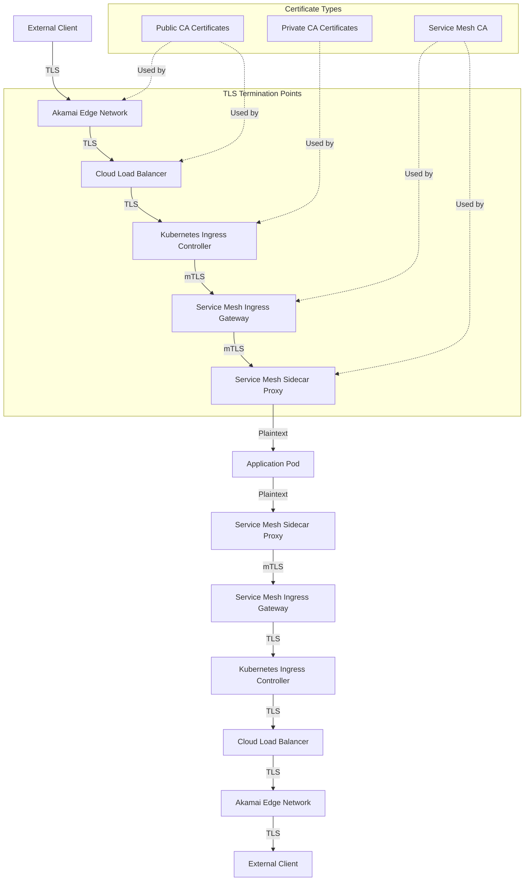
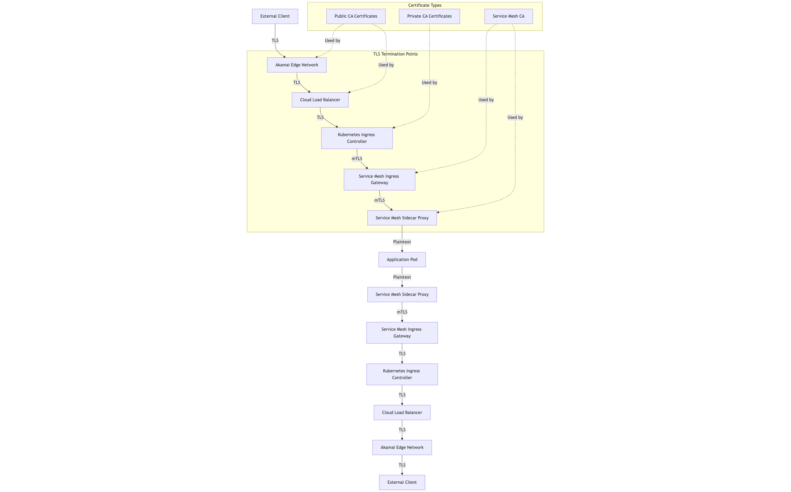

# Kubernetes Production API Flow Architecture

## Table of Contents
- [Overview](#overview)
- [Architecture Components](#architecture-components)
- [API Request Flow Diagram](#api-request-flow-diagram)
- [Detailed Request Flow](#detailed-request-flow)
- [Certificate Inventory and Management](#certificate-inventory-and-management)
- [Security Considerations](#security-considerations)
- [Best Practices](#best-practices)
- [References](#references)

## Overview

This document outlines the complete journey of an API request in a production Kubernetes environment, from the initial client connection to response delivery. It details the security aspects of each component in the flow, with particular emphasis on TLS termination points and certificate management strategies.

The architecture follows a defense-in-depth approach, with multiple layers of security controls from the edge network to the application pods. Each component in the flow plays a specific role in routing, securing, and processing API requests while maintaining performance, scalability, and observability.

## Architecture Components

1. **External Client**: End users or systems making API requests
2. **Akamai Edge Network**: Provides CDN, WAF, and DDoS protection services
3. **Cloud Load Balancer**: Entry point to the cloud provider infrastructure
4. **Kubernetes Ingress Controller**: Manages external access to services in the cluster
5. **Service Mesh (Istio/Linkerd)**: Provides advanced traffic management and mTLS between services
6. **Kubernetes Services**: Service discovery and internal load balancing
7. **Application Pods**: Containers running the actual application code

## API Request Flow Diagram

## Detailed Request Flow

### 1. External Client to Akamai Edge Network
- **Connection Details**: 
  - Client initiates HTTPS connection to public API endpoint
  - TLS 1.3 with modern cipher suites
- **TLS Termination**: Yes, first termination point
- **Certificate Used**: 
  - Public CA-issued wildcard or SAN certificate
  - Managed by Akamai Certificate Management system
- **Security Functions**:
  - DDoS protection
  - Bot detection
  - WAF rules applied (OWASP Top 10 protection)
  - Malicious request filtering
  - Rate limiting

### 2. Akamai to Cloud Load Balancer
- **Connection Details**:
  - Re-encrypted TLS connection from Akamai to cloud provider Load Balancer
  - Restricted by IP allowlisting (only Akamai IPs permitted)
- **TLS Termination**: Yes, second termination point
- **Certificate Used**:
  - Public CA-issued certificate for backend communication
  - Managed through cloud provider's certificate manager
- **Security Functions**:
  - TCP/IP layer protection
  - Provider-level DDoS mitigation
  - TLS policy enforcement

### 3. Cloud Load Balancer to Kubernetes Ingress Controller
- **Connection Details**:
  - TLS connection from Load Balancer to Kubernetes Ingress (e.g., NGINX, Traefik, Kong)
  - Connection scoped to Kubernetes cluster network
- **TLS Termination**: Yes, third termination point
- **Certificate Used**:
  - Private CA-issued certificate
  - Managed through Kubernetes cert-manager
- **Security Functions**:
  - HTTP traffic validation
  - URL path routing
  - HTTP header manipulation
  - Authentication gateway (optional)
  - Rate limiting per service

### 4. Ingress Controller to Service Mesh Ingress Gateway
- **Connection Details**:
  - mTLS connection to Service Mesh Ingress Gateway (Istio/Linkerd)
  - Internal Kubernetes network traffic
- **TLS Termination**: Yes, fourth termination point
- **Certificate Used**:
  - Service Mesh CA-issued certificates
  - Automatically provisioned and rotated by mesh control plane
- **Security Functions**:
  - L7 traffic management
  - Service discovery
  - Circuit breaking
  - Canary deployment support
  - Rich metrics collection

### 5. Service Mesh Gateway to Service Sidecar
- **Connection Details**:
  - mTLS connection from mesh gateway to service sidecar proxy
  - Kubernetes pod-to-pod encrypted communication
- **TLS Termination**: Yes, final termination point
- **Certificate Used**:
  - Service Mesh CA-issued workload certificates
  - Unique per pod/service, auto-rotated
- **Security Functions**:
  - Workload identity validation
  - Authorization policy enforcement
  - Traffic metrics collection
  - Request tracing
  - Service-to-service authorization

### 6. Sidecar Proxy to Application Pod
- **Connection Details**:
  - Plain HTTP connection inside the pod's network namespace
  - Communication between localhost processes
- **TLS Termination**: N/A (plaintext within pod)
- **Certificate Used**: None required
- **Security Functions**:
  - Application-level authentication
  - Input validation
  - Business logic

### 7. Return Path (Response Flow)
- The response follows the reverse path with similar security protections
- Each component adds its respective headers/metadata to the response
- TLS re-encryption happens at each stage on the return path

## Certificate Inventory and Management

### Public-Facing Certificates (Edge to Load Balancer)

| Certificate Location | Type | Purpose | Management Approach |
|----------------------|------|---------|---------------------|
| Akamai Edge | Public CA (DigiCert/Let's Encrypt) | Client communication | Automated via Akamai Certificate Manager, 1-year validity, auto-renewed at 30 days prior to expiry |
| Cloud Load Balancer | Public CA | Akamai to Cloud communication | Managed via Cloud Provider's Certificate Manager, 1-year validity, auto-renewed, alert at 45 days |

### Internal Certificates (Kubernetes Environment)

| Certificate Location | Type | Purpose | Management Approach |
|----------------------|------|---------|---------------------|
| Kubernetes Ingress | Private CA | Cluster Ingress | Managed via cert-manager, 90-day validity, auto-renewed at 30 days prior to expiry |
| Service Mesh CA | Self-signed | Mesh root authority | Auto-generated by mesh installation, 10-year validity, backed up securely |
| Service Mesh Workload | Mesh CA signed | mTLS between services | Auto-provisioned per workload, 24-hour validity, automatically rotated |
| Secret Encryption | KMS-managed | Kubernetes secrets encryption | Cloud KMS integration, automatic rotation policy |

### Certificate Rotation Policy

- **Public Certificates**: Automatically renewed 30 days before expiration
- **Private CA Certificates**: Automatically renewed 30 days before expiration
- **Service Mesh Certificates**: 
  - Root CA: Manual rotation annually with careful coordination
  - Workload Certificates: Automatic rotation every 24 hours
- **Key Management**:
  - All private keys stored in HSM or cloud provider key management services
  - Key access audited and logged

## Security Considerations

### Defense in Depth Strategy

The architecture implements a defense-in-depth approach with multiple security layers:

1. **Edge Security**:
   - DDoS protection at internet edge
   - WAF for application layer attacks
   - IP reputation filtering
   - Bot mitigation

2. **Infrastructure Security**:
   - Network segmentation
   - Cloud provider security groups
   - Private connections where possible

3. **Kubernetes Security**:
   - Network policies (deny by default)
   - Pod security policies
   - Runtime security monitoring
   - Resource isolation
   - Admission controllers

4. **Application Security**:
   - Authentication and authorization
   - Input validation
   - Output encoding
   - Security headers

### TLS Policy and Implementation

- **Minimum TLS Version**: TLS 1.2, with preference for TLS 1.3
- **Cipher Suites**: Modern, strong cipher suites only:
  - TLS_AES_128_GCM_SHA256
  - TLS_AES_256_GCM_SHA384
  - TLS_CHACHA20_POLY1305_SHA256
- **OCSP Stapling**: Enabled for public certificates
- **Certificate Transparency**: Monitored for public certificates
- **Perfect Forward Secrecy**: Required for all TLS connections

### Incident Response Plan for Certificate Issues

1. **Certificate Compromise**: 
   - Immediate revocation
   - Emergency rotation procedure
   - Incident response team notification
   - Impact assessment

2. **Certificate Expiration**:
   - Multi-level alerting (30 days, 14 days, 7 days, 3 days, 1 day)
   - Automated rotation with manual fallback procedure
   - On-call personnel assignment

## Best Practices

### Certificate Management Best Practices

1. **Automation**:
   - Use cert-manager or similar tools for automated certificate lifecycle
   - Implement monitoring for expiration dates
   - Test certificate renewal processes regularly

2. **Security**:
   - Store private keys in HSM or secure key management systems
   - Implement certificate pinning for critical services
   - Regular audit of certificate inventory

3. **Operational**:
   - Documented procedures for emergency certificate rotation
   - Regular testing of certificate renewal processes
   - Centralized certificate inventory and monitoring

### Kubernetes Security Best Practices

1. **Cluster Hardening**:
   - Regular cluster upgrades
   - Secure configuration of Kubernetes components
   - Restricted network access to API server
   - Encrypted etcd

2. **Workload Security**:
   - Immutable containers
   - Minimal base images
   - Principle of least privilege
   - Container image scanning
   - Runtime security monitoring

3. **Network Security**:
   - Default deny network policies
   - Service mesh for service-to-service authentication
   - Egress filtering
   - Network segmentation

### API Security Best Practices

1. **Authentication and Authorization**:
   - OAuth 2.0/OpenID Connect implementation
   - JWT token validation
   - Role-based access control (RBAC)
   - Short-lived access tokens

2. **Traffic Management**:
   - Rate limiting at multiple layers
   - Circuit breakers for backend protection
   - Retry budgets
   - Connection pooling

3. **Observability**:
   - Structured logging
   - Distributed tracing
   - Metrics collection
   - Anomaly detection

## References

- [Kubernetes Documentation - TLS](https://kubernetes.io/docs/concepts/services-networking/ingress/#tls)
- [Istio Security Architecture](https://istio.io/latest/docs/concepts/security/)
- [NIST SP 800-204B - Attribute-based Access Control for Microservices](https://nvlpubs.nist.gov/nistpubs/SpecialPublications/NIST.SP.800-204B.pdf)
- [Cloud Native Security Whitepaper](https://github.com/cncf/tag-security/blob/main/security-whitepaper/CNCF_cloud-native-security-whitepaper-Nov2020.pdf)
- [OWASP API Security Top 10](https://owasp.org/www-project-api-security/)
- [Akamai Security Best Practices](https://www.akamai.com/solutions/security) 