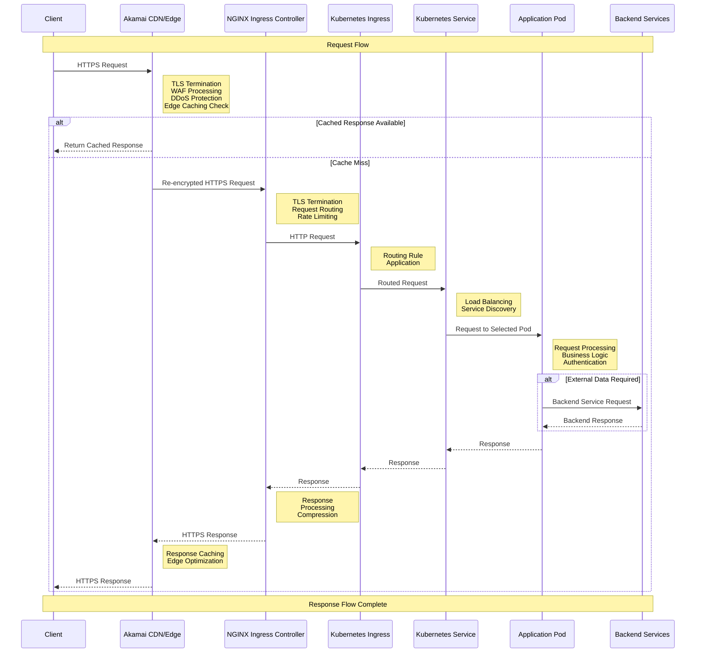
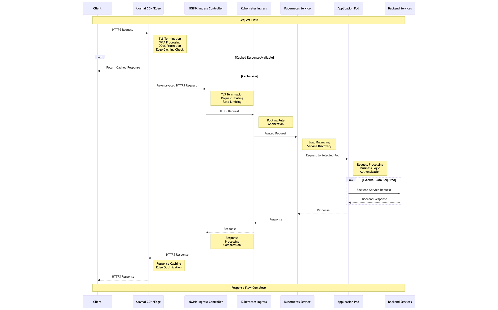

# Kubernetes API Request Flow Architecture

## Table of Contents
- [Overview](#overview)
- [Architecture Components](#architecture-components)
- [Request Flow Sequence Diagram](#request-flow-sequence-diagram)
- [Component Roles and Responsibilities](#component-roles-and-responsibilities)
- [TLS/SSL Certificate Configurations](#tlsssl-certificate-configurations)
- [Security and Performance Considerations](#security-and-performance-considerations)
- [Best Practices and Recommendations](#best-practices-and-recommendations)
- [References](#references)

## Overview

This document outlines the comprehensive journey of an API request in a production Kubernetes environment, from the initial client request to response delivery. The architecture follows industry best practices for security, performance, and reliability, implementing a multi-layered approach to protect and efficiently deliver API services.

The document details how requests flow through each architectural component, focusing on security aspects, performance considerations, and potential failure points. It provides infrastructure teams and technical architects with an in-depth understanding of the platform's request handling mechanisms.

## Architecture Components

The key components in our Kubernetes API request flow architecture include:

1. **Client Application**: The source of API requests (mobile app, web application, or third-party service)
2. **Akamai CDN/Edge Protection**: Global content delivery network and edge protection layer
3. **NGINX Ingress Controller**: Kubernetes entry point for external HTTP/HTTPS traffic
4. **Kubernetes Ingress Resources**: Kubernetes objects defining routing rules
5. **Kubernetes Services**: Internal load balancing and service discovery mechanism
6. **Kubernetes Pods**: Running application containers that process requests
7. **Service Backends**: Databases, caches, and other backing services

## Request Flow Sequence Diagram

## Component Roles and Responsibilities

### Client Application
- **Role**: Originates API requests to the platform
- **Responsibilities**:
  - Forms properly structured API requests
  - Handles authentication tokens/credentials
  - Processes responses
  - Implements retry logic and circuit breaking
  - Maintains secure TLS connections

### Akamai CDN/Edge Protection
- **Role**: Provides edge protection, global distribution, and performance optimization
- **Responsibilities**:
  - **DDoS Mitigation**: Protection against volumetric and application-layer attacks
  - **Web Application Firewall (WAF)**: Blocks common exploitation techniques and attacks
  - **TLS Termination**: Handles initial client SSL/TLS connections
  - **Content Caching**: Stores and serves cacheable API responses
  - **Request Filtering**: Blocks malicious traffic based on signatures and behavior
  - **Geographic Distribution**: Routes requests to nearest data centers
  - **Rate Limiting**: Enforces global rate limits to protect backend services
  - **Bot Detection**: Identifies and manages automated traffic
  - **Edge Computing**: May execute simple transformations at the edge

### NGINX Ingress Controller
- **Role**: Acts as the entry point for external traffic into the Kubernetes cluster
- **Responsibilities**:
  - **TLS Termination**: Handles HTTPS connections from Akamai
  - **Request Routing**: Directs traffic to appropriate services based on URL paths
  - **Load Balancing**: Distributes traffic across multiple service instances
  - **Rate Limiting**: Provides service-specific rate controls
  - **SSL/TLS Management**: Manages certificates for secure communication
  - **Request/Response Manipulation**: Modifies headers, performs redirects
  - **Authentication**: Optional integration with auth services
  - **Health Checks**: Monitors backend services
  - **Metrics Collection**: Captures detailed request metrics

### Kubernetes Ingress Resources
- **Role**: Declarative definition of how external HTTP traffic should be routed
- **Responsibilities**:
  - **Path-based Routing**: Maps URL paths to specific services
  - **Host-based Routing**: Routes traffic based on domain names
  - **TLS Configuration**: Specifies certificate resources for secure connections
  - **Traffic Splitting**: Can be used for canary deployments
  - **Rewrite Rules**: Modifies request URLs before forwarding
  - **Annotation Support**: Provides controller-specific configurations

### Kubernetes Services
- **Role**: Provides stable network identity and load balancing for pods
- **Responsibilities**:
  - **Service Discovery**: Provides DNS names for sets of pods
  - **Load Balancing**: Distributes traffic among available pods
  - **IP Management**: Assigns stable virtual IPs to services
  - **Port Mapping**: Maps service ports to container ports
  - **Session Affinity**: Optional support for sticky sessions
  - **Headless Services**: Allows direct DNS lookup of pod IPs when needed
  - **External Services**: Can represent external endpoints when needed

### Kubernetes Pods
- **Role**: Houses application containers that process requests
- **Responsibilities**:
  - **Application Execution**: Runs application code in containers
  - **Request Processing**: Handles business logic for API requests
  - **Data Validation**: Validates incoming request data
  - **Authentication/Authorization**: Verifies user permissions
  - **Backend Integration**: Communicates with databases and other services
  - **Response Formation**: Generates API responses
  - **Resource Management**: Works within allocated CPU/memory constraints
  - **Health Reporting**: Exposes health status to the cluster

## TLS/SSL Certificate Configurations

### Akamai Edge Certificates (Customer-Facing)
- **Type**: Public CA-issued certificates (DigiCert, Let's Encrypt)
- **Purpose**: Secures communication between clients and Akamai edge
- **Configuration**:
  - **Certificate Type**: Usually wildcard or SAN certificates
  - **Key Size**: 2048-bit RSA or ECC P-256
  - **Validity Period**: Typically 1 year
  - **Management**: Automated through Akamai Certificate Manager
  - **TLS Version**: TLS 1.2/1.3 only
  - **Cipher Suites**: Modern, strong cipher suites only
  - **OCSP Stapling**: Enabled
  - **HTTP Strict Transport Security (HSTS)**: Enabled

### Akamai-to-Origin Certificates
- **Type**: Public or Private CA certificates
- **Purpose**: Secures communication between Akamai and NGINX Ingress
- **Configuration**:
  - **Certificate Type**: Domain-specific certificate
  - **Validation**: Mutual TLS optional for additional security
  - **Management**: Automated with monitoring and alerts
  - **Rotation**: Regularly scheduled rotation (quarterly)
  - **Key Storage**: Secure key storage with restricted access
  - **IP Restrictions**: Typically limited to Akamai IP ranges

### NGINX Ingress Controller Certificates
- **Type**: Kubernetes-managed certificates via cert-manager
- **Purpose**: Terminates TLS connections from Akamai and secures traffic
- **Configuration**:
  - **Certificate Source**: Let's Encrypt or private CA
  - **Validation**: Domain validation automated
  - **Storage**: Kubernetes secrets
  - **Rotation**: Automated renewal before expiration
  - **Key Size**: 2048-bit RSA or ECC P-256
  - **TLS Settings**: Configured via ingress annotations
  - **Secret References**: Referenced in Ingress resources

### Internal Service Mesh Certificates (Optional)
- **Type**: Service mesh CA-issued certificates (e.g., Istio, Linkerd)
- **Purpose**: Enables mTLS between services inside the cluster
- **Configuration**:
  - **Certificate Authority**: Self-signed or intermediate CA
  - **Workload Identity**: Pod-specific certificates
  - **Certificate Lifetime**: Short-lived (24 hours typical)
  - **Rotation**: Automatic rotation before expiration
  - **Key Generation**: Generated on pod startup
  - **Trust Chain**: Managed by service mesh control plane

### Certificate Renewal and Management Processes

1. **Monitoring**:
   - Automated certificate expiration monitoring
   - Alerting at multiple thresholds (30, 14, 7, 3, 1 days)
   - Certificate inventory database

2. **Automation**:
   - cert-manager for Kubernetes certificates
   - Akamai certificate automation for edge certificates
   - API-based renewal processes

3. **Emergency Procedures**:
   - Certificate revocation protocol
   - Emergency replacement process
   - Fallback certificates for critical services
   - On-call rotation for certificate issues

4. **Audit and Compliance**:
   - Regular certificate inventory audits
   - Compliance verification (key strength, algorithms)
   - Certificate transparency monitoring

## Security and Performance Considerations

### TLS Termination Points and Re-encryption

1. **Client to Akamai Edge**:
   - First TLS termination at Akamai edge
   - Modern TLS protocol and cipher suites
   - Complete validation of client certificates if used

2. **Akamai to NGINX Ingress**:
   - Re-encrypted connection with separate certificate
   - Potential for mutual TLS authentication
   - IP-restricted access (Akamai edge IP ranges only)
   - Private network path where possible

3. **Service Mesh Communication (Optional)**:
   - Automatic mTLS between services
   - Certificate-based service identity
   - Encrypted east-west traffic within cluster

### Network Security Controls

1. **Edge Security**:
   - IP reputation filtering
   - Bot management
   - DDoS protection
   - API rate limiting
   - Geo-blocking capabilities
   - Custom WAF rules

2. **Cluster Network Security**:
   - Network policies for pod isolation
   - Ingress/egress restrictions
   - Service mesh traffic policies
   - Namespace isolation
   - Container network security

3. **Pod Security**:
   - Pod Security Policies/Standards
   - Read-only file systems
   - Non-root containers
   - Dropped capabilities
   - Resource limits

### Headers and Metadata Transformation

1. **Client to Akamai**:
   - Client headers preserved
   - Addition of request ID headers
   - Security headers validation

2. **Akamai to Ingress**:
   - True-Client-IP headers added
   - Client certificates translated to headers if used
   - Custom security headers added

3. **Ingress to Service**:
   - Request transformation based on annotations
   - Path rewriting if configured
   - Additional application headers

4. **Service to Pod**:
   - Kubernetes service information
   - Load balancer source preservation
   - Original request metadata

5. **Response Path**:
   - Response headers added at each layer
   - CORS headers managed
   - Security headers enforced
   - Cache control headers processed

### Authentication and Authorization Enforcement

1. **Edge Authentication (Akamai)**:
   - API key validation
   - OAuth token pre-validation
   - JWT signature verification
   - Basic request authentication

2. **Ingress Authentication**:
   - External authentication service integration
   - API gateway token validation

3. **Service-level Authentication**:
   - Service account tokens
   - Internal service authentication

4. **Application Authentication**:
   - Detailed token validation
   - Authorization policy enforcement
   - Role-based access control
   - Multi-tenancy enforcement

### Performance Considerations and Bottlenecks

1. **Edge Performance**:
   - Global Akamai distribution
   - Edge caching for appropriate responses
   - Connection keep-alive
   - Content compression

2. **Ingress Controller Performance**:
   - Controller scaling and redundancy
   - Efficient routing algorithms
   - Connection pooling
   - Worker process optimization

3. **Service Routing Performance**:
   - Efficient service discovery
   - Optimized iptables rules
   - Kernel parameter tuning
   - IPVS mode for kube-proxy

4. **Pod Performance**:
   - Proper resource allocation
   - Horizontal scaling capability
   - Efficient container images
   - JVM/runtime optimization

### Common Failure Points and Resilience Strategies

1. **Edge Failures**:
   - Multiple edge regions
   - Failover configurations
   - Health-based routing
   - Origin shields

2. **Ingress Controller Failures**:
   - Controller redundancy
   - Anti-affinity scheduling
   - Failover configurations
   - Health-based removal

3. **Service Discovery Failures**:
   - DNS caching strategies
   - Short TTLs for critical services
   - Direct endpoint access fallback
   - Headless services when appropriate

4. **Pod Failures**:
   - Readiness/liveness probes
   - Graceful shutdown handling
   - PodDisruptionBudgets
   - Topology spread constraints
   - Horizontal Pod Autoscaling

5. **Backend Service Failures**:
   - Circuit breaking
   - Retry budgets
   - Fallback responses
   - Cache-based resilience

## Best Practices and Recommendations

### Certificate Management

1. **Automated Lifecycle**:
   - Use cert-manager for Kubernetes certificates
   - Implement automated renewal processes
   - Monitor certificate expiration
   - Maintain certificate inventory

2. **Security Best Practices**:
   - Use appropriate key lengths (RSA 2048+, ECC P-256+)
   - Maintain secure private key storage
   - Implement certificate pinning for critical services
   - Regularly rotate certificates

3. **Operational Recommendations**:
   - Standardize on preferred CAs
   - Document emergency certificate procedures
   - Perform regular rotation drills
   - Maintain certificate hierarchy diagram

### Security Hardening

1. **Infrastructure Security**:
   - Keep Kubernetes version updated
   - Apply security patches promptly
   - Implement cluster hardening guidelines
   - Use private networks where possible
   - Enforce least privilege principles

2. **Application Security**:
   - Implement container security scanning
   - Use distroless or minimal base images
   - Perform regular vulnerability scanning
   - Implement runtime threat detection

3. **Network Security**:
   - Default-deny network policies
   - Implement microsegmentation
   - Encrypt all traffic (east-west and north-south)
   - Protect pod-to-pod communication

### Performance Optimization

1. **Edge Optimization**:
   - Configure appropriate caching rules
   - Implement content compression
   - Use edge computing for simple transformations
   - Configure connection pooling

2. **Kubernetes Optimization**:
   - Right-size pod resources
   - Implement horizontal pod autoscaling
   - Configure pod disruption budgets
   - Optimize etcd performance
   - Use node anti-affinity for critical services

3. **Application Optimization**:
   - Optimize container images
   - Implement efficient API designs
   - Use appropriate database indexes
   - Optimize JVM settings for Java applications
   - Implement response compression

### Monitoring and Observability

1. **Infrastructure Monitoring**:
   - Kubernetes cluster monitoring
   - Node and pod metrics
   - Network traffic analysis
   - Certificate expiration monitoring

2. **Application Monitoring**:
   - Request/response metrics
   - Latency tracking
   - Error rate monitoring
   - Dependency health checks

3. **Request Tracing**:
   - Implement distributed tracing
   - Maintain request IDs throughout the chain
   - Trace context propagation
   - Service dependency mapping

4. **Logging Strategy**:
   - Structured logging
   - Centralized log aggregation
   - Log level management
   - Audit logging for security events

5. **Alerting and Dashboards**:
   - SLO-based alerting
   - Multi-level alerting strategy
   - Custom dashboards for different user roles
   - Automated runbooks for common issues

## References

- [Kubernetes Documentation - Ingress](https://kubernetes.io/docs/concepts/services-networking/ingress/)
- [NGINX Ingress Controller Documentation](https://kubernetes.github.io/ingress-nginx/)
- [Akamai Security Best Practices](https://www.akamai.com/solutions/security)
- [cert-manager Documentation](https://cert-manager.io/docs/)
- [CNCF Cloud Native Security Whitepaper](https://github.com/cncf/tag-security/blob/main/security-whitepaper/CNCF_cloud-native-security-whitepaper-Nov2020.pdf)
- [Kubernetes Network Policies](https://kubernetes.io/docs/concepts/services-networking/network-policies/)
- [TLS Best Practices](https://cheatsheetseries.owasp.org/cheatsheets/TLS_Cipher_String_Cheat_Sheet.html) 